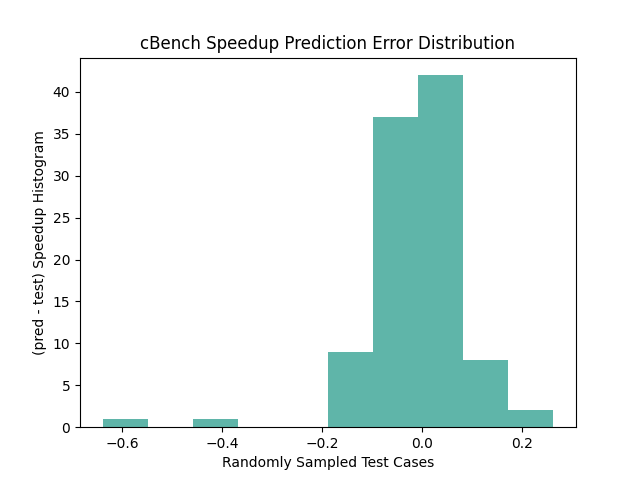
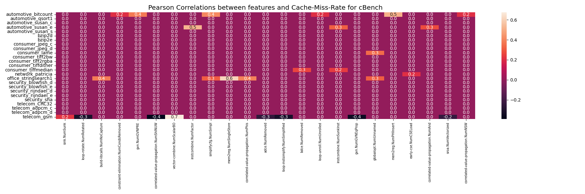
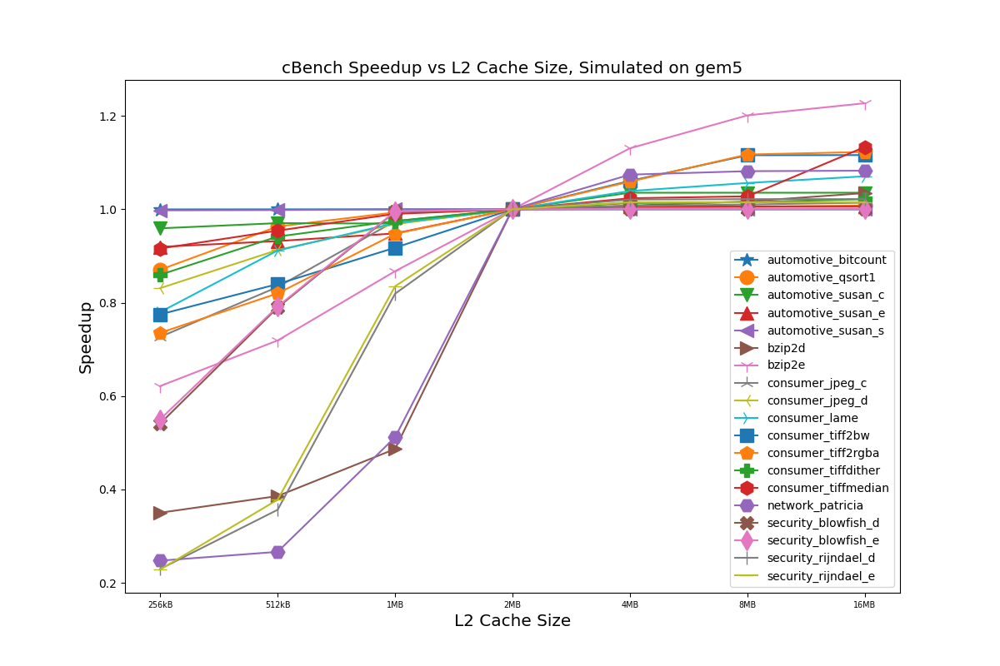
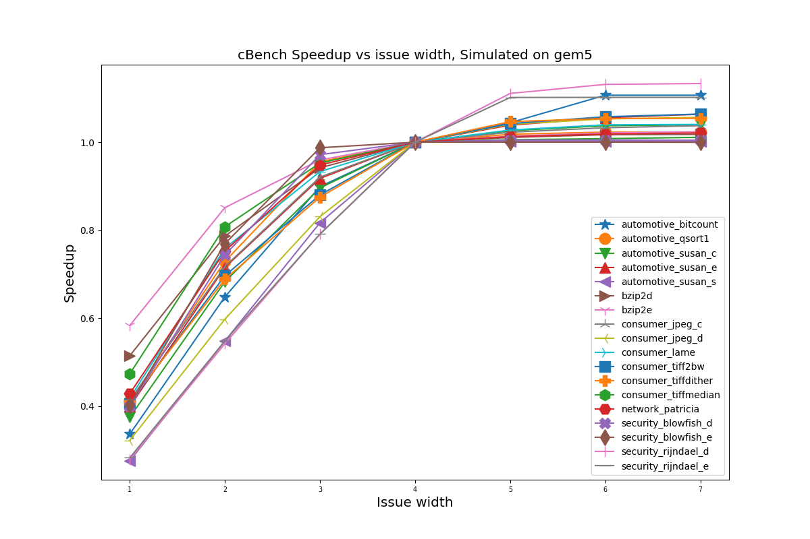

# 软件硬件自动调优和协同设计
本项目旨在自动调优编译器标志和微架构设计。
它包含两部分：第一部分是自动调优的成本模型；
第二部分是硬件设计的框架。
## 先决条件
* Gem5
* cBench
### 安装 Gem5
首先从github克隆Gem5并检出相应的版本：
```shell
git clone https://github.com/gem5/gem5.git
git checkout e8bc4fc137a5a7e82b601432271a027b652ae69b
```
然后，您需要将我们的修改后的补丁文件 `gem5_se.patch` 应用于gem5：
```shell
cd path/to/gem5
git apply path/to/HW-Autotuning/gem5_se.patch
```
然后，
请查看以下链接以构建用于arm模拟的Gem5：
[building-gem5](https://www.gem5.org/documentation/general_docs/building)。
要在X86机器上模拟Arm，您需要 `arm-gnu-toolchain-13.2.Rel1-x86_64-aarch64-none-linux-gnu`。
下载并解压它：
```shell
wget https://developer.arm.com/-/media/Files/downloads/gnu/13.2.rel1/binrel/arm-gnu-toolchain-13.2.rel1-x86_64-aarch64-none-linux-gnu.tar.xz
tar -xvf arm-gnu-toolchain-13.2.rel1-x86_64-aarch64-none-linux-gnu.tar.xz
```
### 安装 cBench
我们已经使用arm工具链构建了一个cBench，
如果您想使用Gem5运行cBench的模拟，则需要将cBench克隆到本地机器：
```shell
git clone https://github.com/summerspringwei/cBench_v1.1_Arm.git
```
<!-- ## 如何安装 -->
## 配置先决条件
您必须将变量 `cbench_dir` 修改为下载的 `cBench_v1.1_Arm` 的路径。
然后，您必须将变量 `gem5_binary`、`scripts_path`、`toolchain_path`、`cbench_home` 和 `cbench_log_dir` 修改为相应的目录。
## 成本模型
我们提供了两种成本模型：
第一种是基于回归的成本模型，它直接预测给定提取特征的速度提升。
第二种是基于排序的成本模型，它预测不同情况之间的相对性能。
### 基于回归的成本模型
运行基于回归的模型：
```shell
python3 regression_cost_model.py
```
您将看到如下输出：
```
INFO - 2024-04-19 21:05:40,089 - prepare_dataset.py:67 - 所有数据集形状：(48728, 198)
INFO - 2024-04-19 21:05:40,428 - regression_cost_model.py:42 - 加载回归模型...
INFO - 2024-04-19 21:05:42,319 - regression_cost_model.py:56 - 平均预测误差：0.20661531330921792
INFO - 2024-04-19 21:05:42,358 - regression_cost_model.py:57 - Sklearn平均分数：0.7243453790989751
预测与真实值之间的相关系数：0.8567691020289628
```
在前面的输出中，平均预测误差约为 `0.20`。
您还可以查看预测误差的分布：

### 基于排序的模型
运行基于排序的模型：
```shell
python3 ranking_cost_model.py
```
您将看到以下输出：
```
INFO - 2024-04-19 21:09:32,223 - mlp_model.py:38 - Start !
INFO - 2024-04-19 21:09:37,527 - ranking_cost_model.py:62 - Feature shape for training: (48728, 198)
/Users/xiachunwei/Software/anaconda3/lib/python3.11/site-packages/torch/optim/lr_scheduler.py:28: UserWarning: The verbose parameter is deprecated. Please use get_last_lr() to access the learning rate.
  warnings.warn("The verbose parameter is deprecated. Please use get_last_lr() "
INFO - 2024-04-19 21:09:40,252 - mlp_model.py:708 - Training size: 38728; Testing size: 10000
INFO - 2024-04-19 21:09:40,252 - mlp_model.py:712 - Epoch: 0
INFO - 2024-04-19 21:09:40,377 - mlp_model.py:629 - Batch: 0, train loss: 3.414378
INFO - 2024-04-19 21:09:42,839 - mlp_model.py:730 - Average test loss: 1.286543, top1 score: 0.882663, top5 score: 0.918474, top10 score: 0.934748
INFO - 2024-04-19 21:09:42,844 - mlp_model.py:712 - Epoch: 1
INFO - 2024-04-19 21:09:42,855 - mlp_model.py:629 - Batch: 0, train loss: 0.326352
INFO - 2024-04-19 21:09:45,470 - mlp_model.py:730 - Average test loss: 1.300602, top1 score: 0.879198, top5 score: 0.917802, top10 score: 0.934217
INFO - 2024-04-19 21:09:45,470 - mlp_model.py:712 - Epoch: 2
INFO - 2024-04-19 21:09:45,479 - mlp_model.py:629 - Batch: 0, train loss: 0.187633
INFO - 2024-04-19 21:09:48,163 - mlp_model.py:730 - Average test loss: 1.304941, top1 score: 0.881098, top5 score: 0.916606, top10 score: 0.935308
```

Top-1分数表明，最出色的真实结果约为预测结果的`0.88`。(越接近1，越好).


## 软硬件协同设计
### 计算皮尔逊相关系数
我们提供了一个框架来评估哪些编译器过程对硬件性能计数器以及端到端延迟至关重要。
对于缓存未命中率：
```shell
python3 ./pearson_relationship.py --label_type cache --threshold 0.2
```
请查看`figures`目录中的`heatmap-Cache-Miss-Rate.png`图：

对于端到端延迟：
```shell
python3 ./pearson_relationship.py --label_type speedup --threshold 0.4
```
请查看`figures`目录中的`heatmap-Speedup.png`图：

您可以增加阈值以过滤掉编译器过程特征。
### 根据性能数据预测基准对缓存大小的敏感性
```shell
python3 predict_gem5_sensitive.py
```
### 运行gem5模拟
我们提供了一个框架来分析微架构设计选择将如何影响最终性能。
```shell
python3 run_gem5.py
```
注意，运行模拟可能需要几个小时甚至几天的时间。模拟时间取决于CPU的性能。
### 可视化模拟结果
在收集了不同架构参数的模拟结果之后，
我们可以展示所有基准测试的延迟如何随参数变化。
```shell
python3 draw_gem5.py
```
我们可以得到延迟与缓存大小的关系图：

我们还可以得到延迟与发射宽度的关系图：

