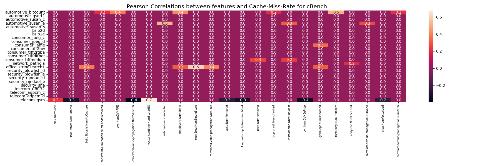
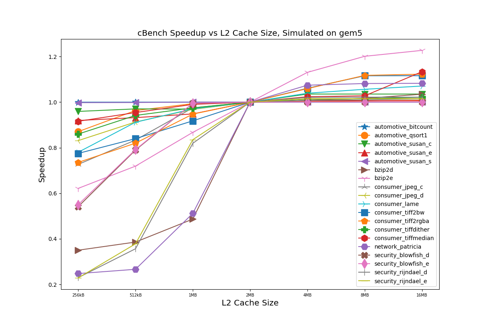

# Software Hardware AutoTuning and Co-Design
This project is built for auto-tuning compiler flags and 
micro-architecture design.
It contains two parts: the first is the cost model for auto-tuning;
the second is the framework for hardware design.

## Pre-requrements

* Gem5
* cBench

### Install Gem5

First clone Gem5 from github and checkout the corresponding version:

```shell
git clone https://github.com/gem5/gem5.git
git checkout e8bc4fc137a5a7e82b601432271a027b652ae69b
```
Then, you need to apply our modified patch file `gem5_se.patch` to the gem5:
```shell
cd path/to/gem5
git apply path/to/HW-Autotuning/gem5_se.patch
```
Then, 
Please see the following link to build Gem5 for arm simulation:
[building-gem5](https://www.gem5.org/documentation/general_docs/building).

To simulate Arm on X86 machine, you need the `arm-gnu-toolchain-13.2.Rel1-x86_64-aarch64-none-linux-gnu`.
Down load and untar it:
```shell
wget https://developer.arm.com/-/media/Files/downloads/gnu/13.2.rel1/binrel/arm-gnu-toolchain-13.2.rel1-x86_64-aarch64-none-linux-gnu.tar.xz
tar -xvf arm-gnu-toolchain-13.2.rel1-x86_64-aarch64-none-linux-gnu.tar.xz
```


### Install cBench

We have built a cBench with arm toolchains, 
you need to clone the cBench to you local machine if you want to run the cBench's simulation with Gem5:
```shell
git clone https://github.com/summerspringwei/cBench_v1.1_Arm.git
```

<!-- ## How to install -->
## Configuration for the Pre-requrements
You must modify the variable `cbench_dir` to the path to the downloaded `cBench_v1.1_Arm`.
Then, you must modify variables `gem5_binary`, `scripts_path`, `toolchain_path`, `cbench_home` and `cbench_log_dir` to the corresponding directory.


## Cost model
We provide two kinds of cost models:
The first is the regression-based cost model which directly predicts the speedup given the extracted features.
The second is the ranking-based cost model which predicts the relative performance between cases.

### regression-based cost model
Run the regression-based model:

```shell
python3 regression_cost_model.py
```
You will see outputs like this:
```
INFO - 2024-04-19 21:05:40,089 - prepare_dataset.py:67 - All dataset shape: (48728, 198)
INFO - 2024-04-19 21:05:40,428 - regression_cost_model.py:42 - Loading the regression model...
INFO - 2024-04-19 21:05:42,319 - regression_cost_model.py:56 - Average prediction error: 0.20661531330921792
INFO - 2024-04-19 21:05:42,358 - regression_cost_model.py:57 - Sklearn average score: 0.7243453790989751
correlation_coefficient between predict and ground_truth: 0.8567691020289628
```
In the previous outputs, the average prediction error is around `0.20`.
You can also check the distribution of prediction errors:


### Ranking based model
Run the ranking-based model:
```shell
python3 ranking_cost_model.py
```

You will see the following outputs:

```
INFO - 2024-04-19 21:09:32,223 - mlp_model.py:38 - Start !
INFO - 2024-04-19 21:09:37,527 - ranking_cost_model.py:62 - Feature shape for training: (48728, 198)
/Users/xiachunwei/Software/anaconda3/lib/python3.11/site-packages/torch/optim/lr_scheduler.py:28: UserWarning: The verbose parameter is deprecated. Please use get_last_lr() to access the learning rate.
  warnings.warn("The verbose parameter is deprecated. Please use get_last_lr() "
INFO - 2024-04-19 21:09:40,252 - mlp_model.py:708 - Training size: 38728; Testing size: 10000
INFO - 2024-04-19 21:09:40,252 - mlp_model.py:712 - Epoch: 0
INFO - 2024-04-19 21:09:40,377 - mlp_model.py:629 - Batch: 0, train loss: 3.414378
INFO - 2024-04-19 21:09:42,839 - mlp_model.py:730 - Average test loss: 1.286543, top1 score: 0.882663, top5 score: 0.918474, top10 score: 0.934748
INFO - 2024-04-19 21:09:42,844 - mlp_model.py:712 - Epoch: 1
INFO - 2024-04-19 21:09:42,855 - mlp_model.py:629 - Batch: 0, train loss: 0.326352
INFO - 2024-04-19 21:09:45,470 - mlp_model.py:730 - Average test loss: 1.300602, top1 score: 0.879198, top5 score: 0.917802, top10 score: 0.934217
INFO - 2024-04-19 21:09:45,470 - mlp_model.py:712 - Epoch: 2
INFO - 2024-04-19 21:09:45,479 - mlp_model.py:629 - Batch: 0, train loss: 0.187633
INFO - 2024-04-19 21:09:48,163 - mlp_model.py:730 - Average test loss: 1.304941, top1 score: 0.881098, top5 score: 0.916606, top10 score: 0.935308
```

The top-1 score shows that the most performant ground truth result is around `0.88` of the predicted one. (The closer to 1, the better).


## Software Hardware Co-Design


### Compute the pearson correlation 

We provide a framework to evaluate which compiler passes are important for the hardware performance counter as well as the end-to-end latency.

For cache miss rate:
```shell
python3 ./pearson_relationship.py --label_type cache --threshold 0.2
```

Please see the figure `heatmap-Cache-Miss-Rate.png` in `figures`:


For end-to-end latency:
```shell
python3 ./pearson_relationship.py --label_type speedup --threshold 0.4
```
Please see the figure `heatmap-Speedup.png` in `figures`:


You can increase the threshold to filter out compiler pass features.


### Predict the benchmark's sensitivity to cache size according to perf data
```shell
python3 predict_gem5_sensitive.py
```

### Run gem5 simulation

We provide a framework to analyze how the micro architecture design choice will affect the final performance.
```shell
python3 run_gem5.py
```
Note, it may take several hours to even several days to run the simulation. The simulation time depends on the performance of the CPUs.


### Visualize simulation results
After collecting the simulation results for different architecture parameters,
we can show the how the latency changes with the parameters for all the benchmarks.
```shell
python3 draw_gem5.py
```
We can get the latency vs the cache size:


We can also get the latency vs issue-width :


